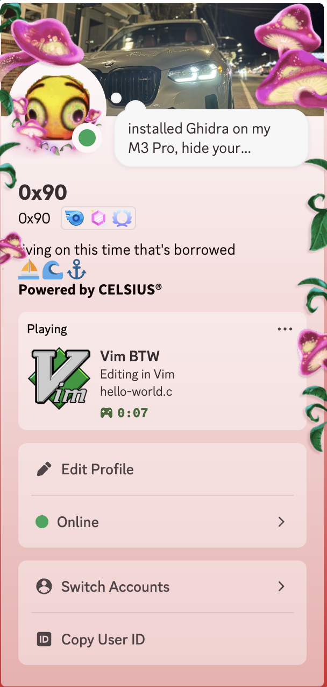

# vim-btw
Discord Rich Presence for Vim (by the way)
>Vim users never quit.

&emsp;&emsp;*— Unknown Author*
### About
Are you tired of having to manually mention to others that you use Vim as your text editor?
Do you want people to *know* that you don't need fancy GUIs, 500 IDE extensions, and other visual slop?
Maybe you don't even know what a mouse is (based) and you've been in a Vim terminal session since the 90's.
The concept of a mouse is so foreign to you, you explain text highlighting using Visual Mode Vim motions.

**Introducing Vim BTW.** A Discord Rich Presence updater so everybody can know that you're in your terminal and you're cooking.
Everybody knows the only thing better than saying "I use Vim by the way" is actually peer programming in Vim with an onlooker.
This program will handle the former for you, guaranteed. Mac users only. Windows users, stick to VS Code or get a new operating system.

### Features
* Updates Discord Rich Presence to show status
    * **Idle:** when the Terminal is open, the status is Idle
    * **Editing:** when Vim is detected being open, the status is "Editing in Vim" and the file name is displayed
* `build.sh` script for project build
* Support for macOS Terminal and Ghostty
* Vim by the way
<p align="center">
  
</p>

### Installation (macOS Tahoe 26.5)
Clone this repo:

```
git clone https://www.m-tedeschi/vim-btw.git
cd vim-btw
```

Run the build script:
```
chmod +x build.sh
./build.sh
```

The Vim BTW application is produced in the project root directory.

From there, you can add the app to your Login Items in Settings, as well as choose whether to show/hide the Menu Bar icon.

### TODO / Known Bugs
* Implement feature: Toggle Privacy Mode
    * Hides the name of the file you're editing
* Finalize behavior for multiple Vim windows open (which one should we
  display?)
* Finalize behavior for Vim inside of tmux sessions (should we display this if
  its in a different session?)
